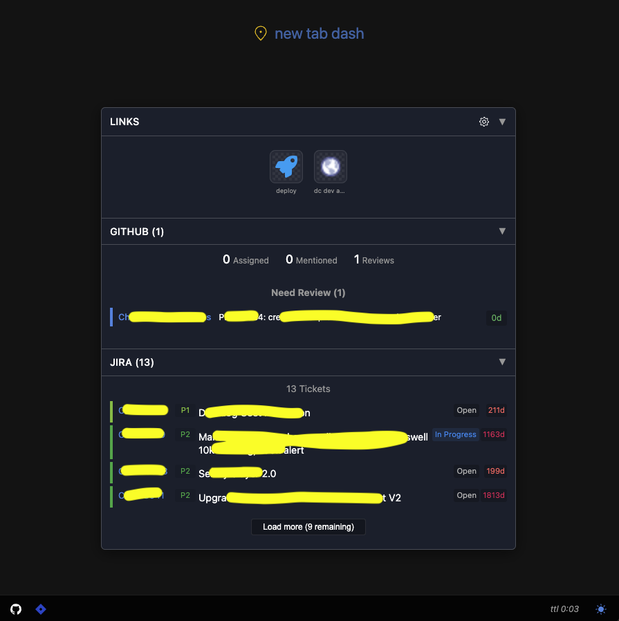

# New Tab Dashboard

A sleek, unified dashboard for your browser's new tab page that brings together GitHub pull requests and Jira tickets in a modern dark-themed interface.

## Features

- **Modern Dark Theme** - Elegant dark theme with subtle gradients
- **GitHub Integration** - View your PRs, assigned PRs, and review requests
- **Jira Integration** - See tickets organized by priority with status indicators
- **Smart UI** - Collapsible sections, status indicators, and refresh controls
- **Performance Optimized** - Intelligent caching system with manual refresh option

## Installation

1. Download or clone this repository
2. Open Chrome/Edge and go to `chrome://extensions/` (Chrome) or `edge://extensions/` (Edge)
3. Enable "Developer mode" using the toggle in the top-right corner
4. Click "Load unpacked" and select the `new-tab-dash-extension` directory
5. The dashboard will now appear every time you open a new tab

## Usage

- **Section Controls**: Click the ▼ arrow next to each section header to collapse/expand that section
- **Service Configuration**: 
  - Click the service icons in the status bar at the bottom to configure each service
  - GitHub and Jira require API tokens (instructions provided in the configuration modal)
- **Theme Customization**: Click the sun/moon icon in the status bar to choose from multiple theme options
- **Manual Refresh**: The timer in the status bar shows when data will automatically refresh - click it to force a manual refresh
- **Item Interaction**: Click on any PR or Jira ticket to open it in a new tab

## Troubleshooting

If data doesn't load:
1. Check the connection status indicators in the status bar
2. Verify your API tokens are valid and still active
3. Try refreshing manually by clicking the timer
4. Check browser console for errors (F12 → Console)
5. Re-enter credentials if needed

## Development

To make changes:
1. Edit files in `new-tab-dash-extension/`
2. Reload the extension (chrome://extensions, click ↻)
3. Use browser DevTools to debug (right-click → Inspect)